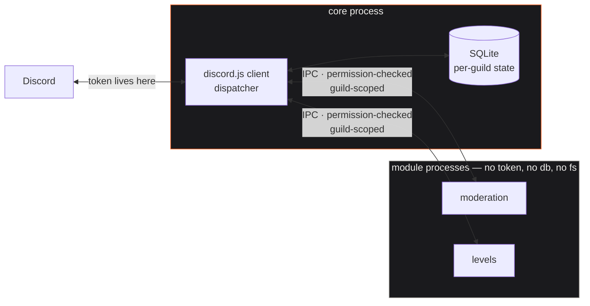

<div align="center">

# Tessel

**A Discord bot with no features of its own.**

You install the ones you want, one server at a time.

[](#verification)
[](#requirements)
[](#)
[](#security)

[Browse modules](https://anthonyf2312.github.io/modules.html) ·
[Write a module](docs/modules/README.md) ·
[Deploy it](docs/deployment.md)

</div>

---

*Tessellation — the art of fitting shapes together with no gaps and no overlaps.*

A module enabled in one server is **invisible in every other**. Its commands don't appear, its
code doesn't run, its data isn't shared. Each one tiles into the whole without touching its
neighbours.

```
/module install https://github.com/someone/moderation
/module load moderation
```

That's it. The commands appear in *your* server. **Nothing restarts.**

---

## The hard part

Modules are code written by strangers, installed from GitHub by whoever runs the server.

If that code ran inside the bot process it could read `process.env.DISCORD_TOKEN`, open the
SQLite file, and quietly ship both somewhere. Node's `vm` module is explicitly **not** a
security boundary, so this had to be solved architecturally rather than with careful review.

**Module code never imports discord.js and never sees the token.** It runs in its own child
process and talks to core over a brokered channel, where every call is checked against the
permissions that server approved.



## Security

Isolation is **two independent layers**. An escape has to defeat both.

| | |
|---|---|
| **Node's permission model** | Spawned with `--permission`, granting read access only to the module's own bundle. Denies every filesystem write, `child_process`, `worker_threads` and native addons at the runtime level. `--disallow-code-generation-from-strings` removes `eval` and `new Function`. |
| **The bootstrap** | Runs to completion *before* any module code. Denies `node:fs`, `net`, `http`, `child_process` and friends at module resolution, deletes `fetch` and every ambient network global, replaces `process.env` with a frozen empty object, and freezes the intrinsics so none of it can be undone. |

Outbound HTTP isn't a global — it's a brokered call, checked against hostnames the module
declared and the admin approved.

**What this does not do** is make a module harmless. A module granted `messages.read` plus an
outbound host can lawfully send your members' messages to its author. The sandbox constrains
*capability*; the permission consent screen and the signing model constrain *who gets it*.

### Reviewed and unreviewed

Every module is **signed** or **unsigned**, and there is no third state.

A signature covers `moduleId + version + commit SHA + bundle hash` — deliberately not the repo
URL, because tags move and branches get force-pushed. Retag or amend after review and the hash
changes, so the module silently drops back to unsigned. That tamper-evidence is the entire
point: a signature can't be inherited by code nobody looked at.

Unsigned modules still install. You just get told, plainly, that nobody has reviewed the code
and it could be malware, and you have to click through it.

If the catalogue is unreachable or fails verification, **everything reads as unsigned**. It
fails closed on trust and open on function: the bot keeps working, it just stops vouching.

## Writing a module

Two files. A manifest, and the code.

```jsonc
// module.json
{
  "id": "com.github.yourname.greeter",
  "name": "Greeter",
  "version": "1.0.0",
  "apiVersion": "1",
  "description": "Greets people, and counts how many times.",
  "author": "yourname",
  "entry": "src/index.ts",
  "permissions": ["storage"],
  "commands": [{ "name": "greet", "description": "Say hello" }]
}
```

```ts
// src/index.ts
import { defineModule } from '@tessel/sdk';

export default defineModule({
  commands: {
    async greet(ctx) {
      const count = Number((await ctx.storage.get('greetings')) ?? '0') + 1;
      await ctx.storage.set('greetings', String(count));
      ctx.reply(`Hello! That's greeting number ${count} in this server.`);
    },
  },
});
```

Push to GitHub. That's the whole module.

Commands are declared as **data, not code** — which is what lets the bot register your slash
commands without ever executing your code.

**Real modules, ready to install:**
[Ping](https://github.com/anthonyf2312/tessel-ping) (no permissions) ·
[Welcome](https://github.com/anthonyf2312/tessel-welcome) (events + config) ·
[Moderation](https://github.com/anthonyf2312/tessel-moderation) (message scanning, warnings, timeouts)

**→ [Full authoring guide](docs/modules/README.md)** — manifest reference, the SDK, the
permission catalogue, storage, publishing, and what you can't do and why.

## Commands

| Command | What it does |
|---|---|
| `/module install <url>` | Install from a GitHub URL. Pins to a commit, warns if unsigned. |
| `/module load <module>` | Approve its permissions and turn it on here. |
| `/module unload <module>` | Turn it off. Its commands disappear from this server. |
| `/module list` | What's installed here, and what's on. |
| `/module info <module>` | What it is, what it can do, which commit it's pinned to. |
| `/module uninstall <module>` | Remove it and everything it stored in this server. |

All require **Manage Server**.

## Requirements

**Node 24+.** The sandbox depends on `--permission` and `module.registerHooks`; neither exists
in older releases.

```sh
npm install
cp .env.example .env        # fill in DISCORD_TOKEN and DISCORD_APPLICATION_ID
npm run sign -- keygen      # prints CATALOGUE_PUBLIC_KEY for your .env
npm run dev
```

Invite the bot with the `bot` and `applications.commands` scopes. Core itself uses only the
`Guilds` intent. Modules that need member or message events require the operator to opt in via
`PRIVILEGED_INTENTS` — see [.env.example](.env.example).

**→ [Running it on a home server](docs/deployment.md)** — systemd unit, Tailscale SSH, backups.
Tessel is outbound only: no ports, no reverse proxy, no domain.

## Layout

```
packages/protocol/         the module contract: manifest schema, permission catalogue
packages/sandbox-runtime/  the security boundary: bootstrap, spawn, supervisor
packages/installer/        untrusted repo → verified artifact
packages/db/               per-guild state on node:sqlite
packages/manager/          store + supervisor + routing
packages/sdk/              @tessel/sdk — what module authors import
apps/bot/                  core: the only process that holds the token
```

| Script | |
|---|---|
| `npm run dev` | Run the bot |
| `npm test` | Vitest, including the sandbox escape suite |
| `npm run typecheck` | Every workspace |
| `npm run sign -- keygen` | Create the catalogue signing keypair |
| `npm run sign -- add <url>` | Print a catalogue entry, using the real install pipeline |
| `npm run sign -- catalogue <file>` | Sign `modules.json` |

## Verification

**227 tests.** The ones that matter most spawn real sandboxed processes and run real attacks:
reading a planted secret, reading a database file, writing files, `child_process`,
`worker_threads`, importing `node:net`, reaching `fetch`, reading `DISCORD_TOKEN`, touching raw
IPC, re-patching frozen intrinsics. Every one asserts the escape *failed*.

Each probe was also run **unhardened** to confirm it genuinely succeeds without the sandbox —
`fetch:ESCAPED ipc:ESCAPED freeze:ESCAPED token:ESCAPED`. A probe that silently no-ops would
make the suite pass while proving nothing.

The same standard applies to the installer: the hostile tarball in the extraction tests really
does write outside its destination when policy is removed.

## Why nothing restarts

Modules are processes. Commands are guild-scoped REST registrations made on demand. The
dispatcher resolves handlers from a registry per call, and gateway listeners attach exactly
once at boot.

Installing, enabling, updating or removing a module never touches the core process.
**Only changes to core code require a restart.**

## Status

Everything above is built and tested. Not yet done:

- A live run against a real bot token, and whatever that shakes out
- `/module update` — the other six subcommands are implemented
- Example module repositories to seed the catalogue
- An `/owner revoke` command. Revocation is enforced at install time and the catalogue carries
  a `revoked` list, but nothing drives it from Discord yet

## Storage note

Persistence uses Node's built-in `node:sqlite` rather than better-sqlite3. Not a preference:
better-sqlite3 has no prebuilt binary for Node 24, and Node 24 is required by the sandbox, so a
native driver would mean every install needs a C++ toolchain. Node still marks `node:sqlite`
experimental; the start script silences the warning.

---

<div align="center">
<sub>Built by <a href="https://anthonyf2312.github.io">Anthony</a> · MIT</sub>
</div>
